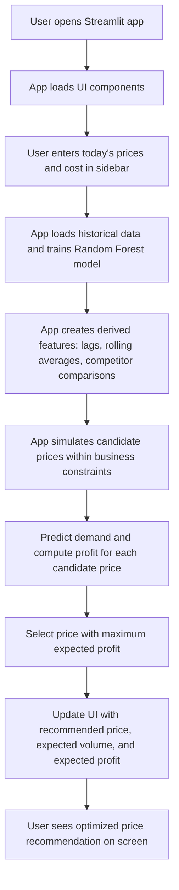

# Fuel-Price-Optimization

Live Demo : https://fuel-price-optimization-bymaruti.streamlit.app/

## Overview
This project recommends the optimal daily fuel price to maximize profit using a Random Forest regression model. It considers historical data, competitor prices, and business constraints.

## Features
- Predict daily fuel demand using Random Forest
- Compute rolling and lag features
- Simulate candidate prices and calculate expected profit
- Recommend the optimal price
- Streamlit interface for interactive input

## Installation
1. Clone the repository:
```bash
git clone https://github.com/Maruti-Margale/Fuel-Price-Optimization/tree/Maruti
cd fuel-price-optimization
```


